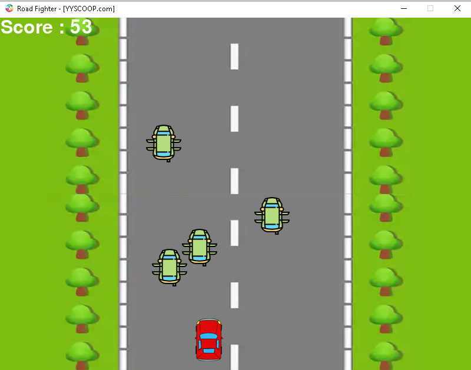

# Road-Fighter
> `Road Fighter` is a car-based arcade game developed using python.
<br/>



## Usage

1. Open your Terminal/cmd

2. git clone this project to your preferred directory.

3. `cd Road-Fighter`

4. `python RoadFighter.py`

<br/>

or Execute:


```
ExecuteRoadFighter.cmd
```

## Dependencies

- Pygame (http://pygame.org)

## Installation
Set up a virtual environment and install the dependencies:
```sh
pip install -r requirements.txt
```

## License
This project is licensed under the terms of the [GLP-3.0 license](https://github.com/yyscoop/Road-Fighter/blob/master/LICENSE)
